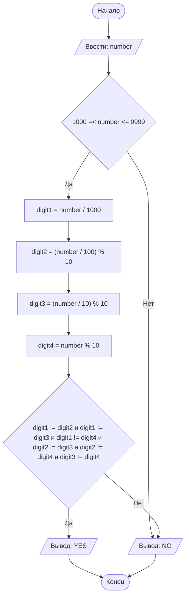

## Отчет по лабораторной работе № 1

#### № группы: `ПМ-2401`

#### Выполнил: `Тараканов Владислав Алексеевич`

#### Вариант: `27`

### Cодержание:

- [Постановка задачи](#1-постановка-задачи)
- [Входные и выходные данные](#2-входные-и-выходные-данные)
- [Выбор структуры данных](#3-выбор-структуры-данных)
- [Алгоритм](#4-алгоритм)
- [Программа](#5-программа)
- [Анализ правильности решения](#6-анализ-правильности-решения)

### 1. Постановка задачи

> На вход программы подается натуральное число. Определить, является ли
> оно 4-хзначным числом, все цифры которого различны ("YES"/"NO").

Данную задачу можно разделить на 2 подзадачи: проверка на количество разрядов числа и проверка на то, что число состоит из разных цифр.

- Для 1 подзадачи нужно рассмотреть 2 случая:
    1. `number >= 1000 && number <= 9999`
    2. `number < 1000 && number > 9999` (отрицание 1 случая)
- Пусть введенное число 4-х значное, тогда для 2 подзадачи нужно также рассмотреть 2 случая:
    1. Все цифры числа различны
    2. Не все цифры числа различны (отрицание 1 случая)

Всего надо рассмотреть `2 * 2 = 4` случая.

### 2. Входные и выходные данные

#### Данные на вход

На вход программа должна получать одно число, при этом в условии сказано, что число относится к множеству натуральных чисел. Но не даны верхняя и нижняя границы получаемого числа. Будем считать, что число может быть введено из всего диапазона натуральных чисел.

|        | Тип              | min значение    | max значение     |
|--------|------------------|-----------------|------------------|
| number | Натуральное число | -2<sup>31</sup> | 2<sup>31</sup>-1 |

#### Данные на выход

Программа должна вывести строку 'YES' или 'NO'.

|        | Тип    | 
|--------|--------|
| Строка | String | 

### 3. Выбор структуры данных

Программа получает одно натуральное число. Поэтому для его хранения
можно выделить одну переменную (`number`) типа `int`.

|       | название переменной | Тип (в Java) | 
|-------|---------------------|--------------|
| Число | `number`            | `int`        |

Для вывода результата необязательно его хранить в отдельной переменной.

### 4. Алгоритм

#### Алгоритм выполнения программы:

1. **Ввод данных:**  
   Программа считывает натуральное число, обозначенное как `number`.

2. **Проверка количества разрядов числа:**  
   Программа сравнивает значение 'number' c 1000 и 9999, если 1000<= 'number' <=9999, программа переходит к проверке цифр 
   числа, иначе выводит 'NO'.

3. **Проверка цифр числа:**  
   Введенное число разбивается на отдельные цифры, если они различны, то выводится 'YES', иначе 'NO'.

4. **Вывод результата:**  
   На экран выводится либо строка 'YES', либо строка 'NO'.

#### Блок-схема



### 5. Программа

```java
import java.io.PrintStream;
import java.util.Scanner;

public class Main {
    // Объявляем объект класса Scanner для ввода данных
    public static Scanner in = new Scanner(System.in);
    // Объявляем объект класса PrintStream для вывода данных
    public static PrintStream out = System.out;

    public static void main(String[] args) {

        // Считывание одно натуральное число n из консоли
        int number = in.nextInt();

        // Определяем является ли n 4-х значным числом
        if (number >= 1000 && number <= 9999) {
            // Если х 4-х значное число, то разбиваем его на цифры и сравниваем их
            // Если х не 4-х  значное число, выводим NO

            int digit1 = number / 1000;
            // Находим первую цифру числа n. Так-как число 4-х значное,
            // первая цифра находится делением на 1000

            int digit2 = (number / 100) % 10;
            // Находим вторую цифру числа n

            int digit3 = (number / 10) % 10;
            // Находим вторую цифру числа n

            int digit4 = number % 10;
            // Находим вторую цифру числа n

            // Проверяем все-ли цифры числа n различны.
            // Если да, то выводим YES, иначе NO.
            if (digit1 != digit2 && digit1 != digit3 && digit1 != digit4 &&
                    digit2 != digit3 && digit2 != digit4 &&
                    digit3 != digit4) {
                out.println("YES");
            } else {
                out.println("NO");
            }
        } else
            out.println("NO");
    }
}
```

### 6. Анализ правильности решения

Программа работает корректно на всем множестве решений с учетом ограничений.

1. Тест на `number > 9999`:

    - **Input**:
        ```
        10000
        ```

    - **Output**:
        ```
        NO
        ```

2. Тест на `number < 1000`:

    - **Input**:
        ```
        999
        ```

    - **Output**:
        ```
        NO
        ```

3. Тест на `1000 <= number <= 9999` и цифры не различны:

    - **Input**:
        ```
        1223
        ```

    - **Output**:
        ```
        NO
        ```

4. Тест на `1000 <= number <= 9999` и цифры различны:

    - **Input**:
        ```
        1234
        ```

    - **Output**:
        ```
        YES
        ```

5. Тест на ограничение задачи:

    - **Input**:
        ```
        2^31-1
        ```

    - **Output**:
        ```
        NO
        ```
